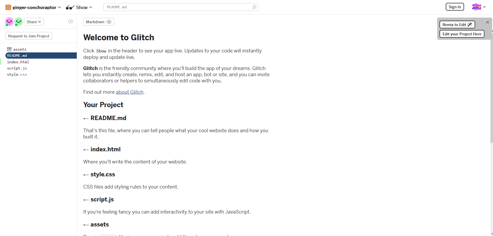
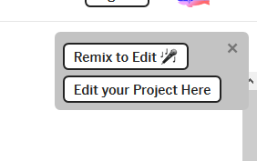
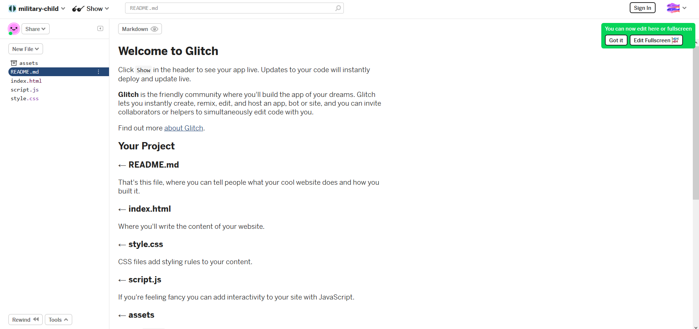
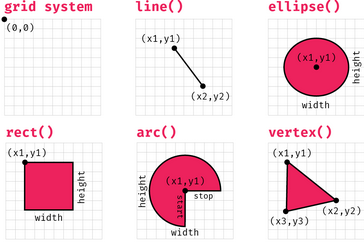
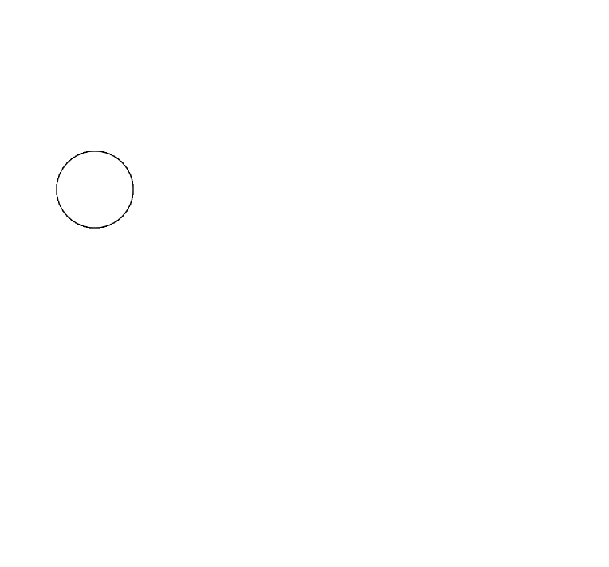
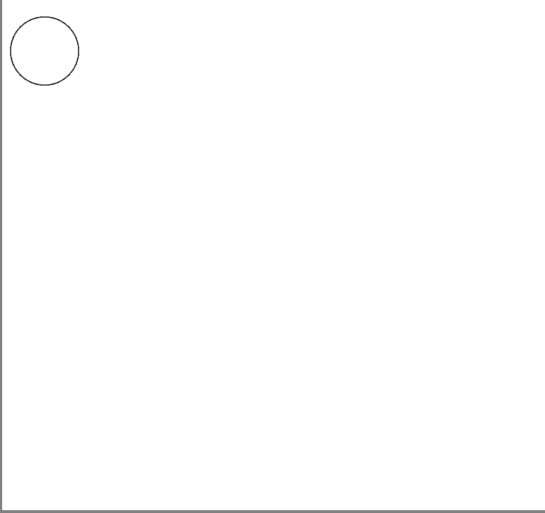
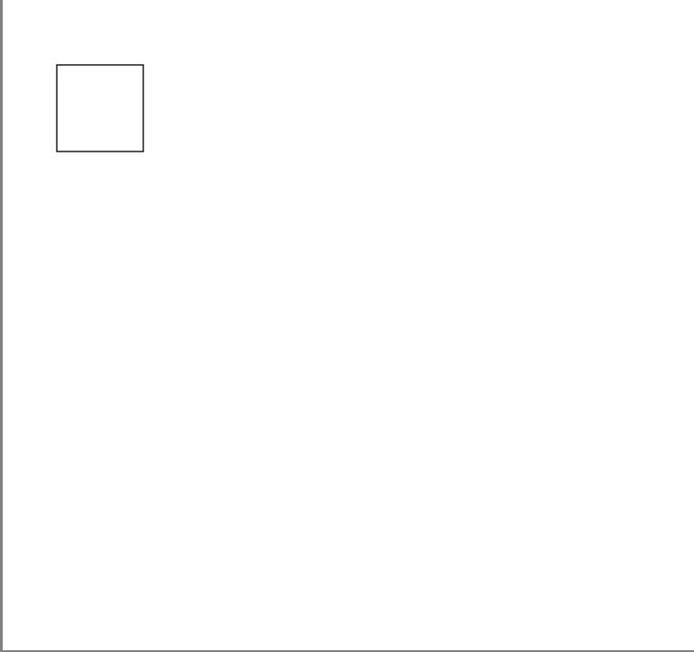
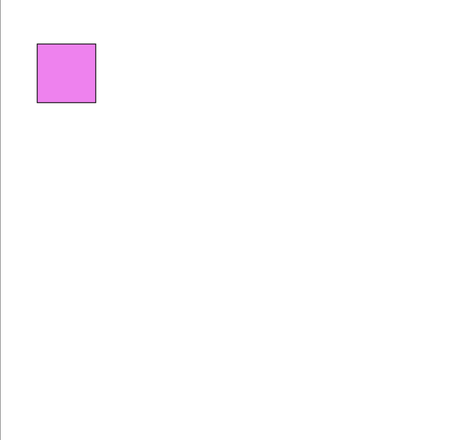

# Playing with p5.js

## Table of Contents

<!-- - [Playing with p5.js](#playing-with-p5js) -->
  - [Table of Contents](#table-of-contents)
  - [Requirements and Dependencies (Mainly for workshop helpers)](#requirements-and-dependencies-mainly-for-workshop-helpers)
  - [Introduction to programming](#introduction-to-programming)
    - [Variables](#variables)
    - [Conditionals](#conditionals)
    - [Functions](#functions)
  - [Basic Drawing in p5.js](#basic-drawing-in-p5js)
    - [Ellipse](#ellipse)
    - [Rect](#rect)
    - [Fill](#fill)
  - [Events in p5.js](#events-in-p5js)
    - [keyPressed](#keypressed)
    - [key & keyCode](#key--keycode)
    - [keyIsDown](#keyisdown)
  - [Activity 1: Playing with the Snake Game](#activity-1-playing-with-the-snake-game)
    - [Looking at a snake game](#looking-at-a-snake-game)
    - [Making the snake faster](#making-the-snake-faster)
    - [Making the playground bigger](#making-the-playground-bigger)
    - [Changing colour of things](#changing-colour-of-things)
  - [Activity 2: Making a drawing game](#activity-2-making-a-drawing-game)
    - [Starting simple](#starting-simple)
    - [Extra: Random Colours](#extra-random-colours)
  - [References](#references)

## Requirements and Dependencies (Mainly for workshop helpers)

- p5.js
- Glitch

Glitch is a platform for creating demo and prototype of Javascript application. It will be the main tool used by us for this workshop.

To set it up, first go to the url provided on [Glitch](https://glitch.com/).

You should see a project page with preexisting code like this:



Click on the `Remix to Edit` button on the upper right.



After clicking the button, Glitch would load for a brief moment before showing this page; Now you can edit the code and play around with it! You can always refer to the original URL for live code update from the workshop conductor as well!



## Introduction to programming

So what is programming?

Programming is basically the process of writing instructions for the computer. Basically, through programming, we can talk to the computer and tell them how to do something.

So, how do we actually program? Well, we do it through programming languages, which is a english like language that we can somehow understand and write, which the computer can also understand through the use of another program called a compiler or intrepreter.

In this workshop, we will be using Javascript, along with p5.js to tell the computer to do something for us!

> p5.js is a JavaScript library for creative coding, with a focus on making coding accessible and inclusive for artists, designers, educators, beginners, and anyone else!

### Variables

Variables lets us save a piece of data by giving it a name, so we can retrive or change it later.

It similar how you save a file so you can use it later.

In javascript, we do it like this:

```javascript
// Here we saved the information!
let x = 5;
let y = 6.0;

// we can also do words!
let someName = "John"

// Now we can use it!
let z = x + y;
console.log(someName);
```

You can also save a bunch of data, in a **list**!

```javascript
// Declaring a collection of data!
let myList = [1, 2, 3];
let myOtherList = [];

// Adding things into the list
myOtherList.push(6);
```

### Conditionals

Conditionals refers to the code constructs that allows you to do things(Run code) based on some condition!

One of them is the `if` statement, which works like so:

```javascript
x = 5;
y = 10;

// If x plus y is more than 10
if(x + y > 10){
  console.log("Its more than 10!");
}else if(x + y < 5){ //if x plus y is less than 5
  console.log("Less than 5!");
}else{
  // if x + y is not more than 10 or less than 5 (What value falls in here?)
  console.log("I don't know?");
}
```

Change the value of x and y and see what happens!

We can also perform something multiple times until we fullfill a condition, which is called a loop. We can do this via the `for` statement.

```javascript
// This loops runs like so
// let a variable i = 0, we run the loop as long as i is less than 10
// and at the end of every loop (when the code inside finish running once),
// we add i by 1
for(let i = 0; i <10; i++){
  console.log(i); //So this will print out 0 ... 9 and then stop :)
}
```

There's much more conditionals out there, which we might discover later, but do explore more yourself if interested!

### Functions

Functions is a slightly more confusing concept, but what it is actually quite straight forward!

Functions is basically just a bunch or a block of code that you can use over and over again just by calling the function name: Its a variables that refers to a bunch of code!

Let me show you:

```javascript
// Defining a function
function myFunction(){
  // Fyi, console.log is a function too!
  console.log("Called you!");
}

// Calling it
myFunction();
// Calling it again
myFunction();

// Defining another function that takes some values~
function addBoth(x, y){
  console.log(x + y)
}
addBoth(1,2); //3
addBoth(2,3); //5
```

## Basic Drawing in p5.js

Let's start with learning how to draw simple shapes in p5.js.

First, go to `script.js`.

You should see code like this in there:

```js
// This functions runs once at the start of the program
function setup() {
  createCanvas(640, 600);
  background(255);
}

// This function loops; As in it will be called continuously throughout the application
function draw() {
}
```

Here, you can see `createCanvas(640, 600)` which is a function that creates a drawing board in the body of a html document for p5.js.

You also see `background(255)`, which sets the background to white (Using RGB values).

p5.js uses a grid system for its canvas, so you have to provide coordinates to things that you draw. It looks something like this:



### Ellipse

Let's start by drawing a circle, or otherwise known as a ellipse. To draw an ellipse. we use a function called `ellipse(x,y,width,height)`.

`x`, `y`, `width`, `height` here are the **parameters** that tells the `ellipse()` function what are the coordinates (`x`, `y`) and size (`width`, `height`) of the circle I want to draw.

You use it like so :

```js
// This functions runs once at the start of the program
function setup() {
  createCanvas(640, 600);
  background(255);
}

// This function loops; As in it will be called continuously throughout the application
function draw() {
    ellipse(100, 200, 80, 80);
}
```

The result:


You can also use variables to store the **parameters** if they can be calculated or acquired later.

```js
let x = 50;
let y = 60;

// This functions runs once at the start of the program
function setup() {
  createCanvas(640, 600);
  background(255);
}

// This function loops; As in it will be called continuously throughout the application
function draw() {
    ellipse(x, y, 80, 80);
}
```

The result:


### Rect

Similarly, you can draw a rectangle via using the `rect(x, y, width, height)` function.

```js
// This functions runs once at the start of the program
function setup() {
  createCanvas(640, 600);
  background(255);
}

// This function loops; As in it will be called continuously throughout the application
function draw() {
    ellipse(100, 200, 80, 80);
}
```

The result:


### Fill

We had been drawing shapes, but just in case you haven't realised, the shapes that we drew does not have any colour, how do we change that?

Simply use another function of course!

`fill(red, green, blue)` is a function that allows you to set the colour of the insides of the next thing you draw. It takes 3 parameters: `red`, `green` and `blue`, to allow you to change colours.

To demonstrate, let me change the colour of the rectangle we had to violet. According to my google search, violet had the value of 238 red, 130 green and 238 blue. Let's pluck that value in it and see what happens.

```js
let x = 50;
let y = 60;

// This functions runs once at the start of the program
function setup() {
  createCanvas(640, 600);
  background(255);
}

// This function loops; As in it will be called continuously throughout the application
function draw() {
    fill(238,130,238);
    rect(x, y, 80, 80);
}
```

Result:



**Tada !**

Now, you might be thinking that drawing with code is good and all, but is it all it can do? This is where *Events* comes in.

## Events in p5.js

p5.js provided us with some functions to make our drawing **react** to what we do. Let's take a look:

### keyPressed

p5.js provide us with a `keyPressed()` function that we can implement. Here is how:

```js
let x = 50;
let y = 60;

// This functions runs once at the start of the program
function setup() {
  createCanvas(640, 600);
  background(255);
}

// This function loops; As in it will be called continuously throughout the application
function draw() {
    fill(238,130,238);
    rect(x, y, 80, 80);
}

function keyPressed(){
  rect(100, 200, 100, 100);
}
```

Go back to your application and try pressing any key. What happens?

### key & keyCode

When any key is pressed, the `keyPressed` function will be called. That's why we rely `key` and `keyCode` to keep track of the key pressed.

The `key` and `keyCode` variables holds value to the current keyboard key that you are clicking on. `key` holds the literal value (Meaning that letter C would cause it to hold 'C' as a value), but `keyCode` holds the code for the key (For example, letter C has key code 67 and the spacebar has key code of 32).

Both can be used, but key code are usually used to detect instances of special key like the Return key or the Space bar.

```js
let x = 50;
let y = 60;

// This functions runs once at the start of the program
function setup() {
  createCanvas(640, 600);
  background(255);
}

// This function loops; As in it will be called continuously throughout the application
function draw() {
    fill(238,130,238);
    rect(x, y, 80, 80);
}

function keyPressed(){
  if(key == 'c'){
    rect(100, 200, 100, 100);
  }
  if(keyCode == 32){
    rect(400, 200, 100, 100);
  }
}
```

You may notice that I used the special symbol, `==`. It is actually called logical operators, and they allow us to compare conditions specified in the conditional statement (`if` and `else`). `a == b` checks if the value of `a` is equals to `b` and only resolve to true if it is equal. There are many more logical like the "AND" operator (`&&`) and the "OR" operator, which can allow us to do more comparisons! Go check them out!

Now, when the 'c' key or the 'C' key is pressed, I would set the background to 255, which is white, which will also reset everything on it! Success!

### keyIsDown

What about if I want to detect when a key is held down?

There is a special function that let us detect that event, `keyIsDown()`. The function is used like so:

```js
let x = 50;
let y = 60;

// This functions runs once at the start of the program
function setup() {
  createCanvas(640, 600);
  background(255);
}

// This function loops; As in it will be called continuously throughout the application
function draw() {
    fill(238,130,238);
    ellipse(x, y, 60, 60);

    // Drop a keycode into the function tested with an if statement
    if (keyIsDown(32)) {
      x = x + 10;
      y = y + 10;
      ellipse(x, y, 60, 60);
    }
}
```

Here, as stated before, the `keyCode` of 32 refers to the spacebar. The function `keyIsDown` inform us if the key of spacebar is pressed down, via a true or false value. Thus, when using it in conjunction with the `if` statement, the code inside the `if` statement only runs as long as the key is held down.

Try holding down the key, you should see a moving circle that goes down diagonally!

## Activity 1: Playing with the Snake Game

### Looking at a snake game

Let's first open up the prepared snake game. Play with the game, try looking at the existing code for a while!

Now, let's look at its code. Open up index.js. First you'll see this.

```javascript
function setup() {
  createCanvas(400, 400);
  w = floor(width / rez);
  h = floor(height / rez);
  frameRate(5);
  snake = new Snake();
  foodLocation();
}
```

As you may see, we create a drawing board for our drawings, and record its width and height in variables `w` and `h`. We also set the framerate (Basically how many times we redraw per second) to 5 to create a arcade like feeling for the snake game. We then create a new Snake via calling `new Snake()`, and call the `foodLocation()` function to create food for the snake to eat.

```javascript
function foodLocation() {
  let x = floor(random(w));
  let y = floor(random(h));
  food = createVector(x, y);
}
```

The `foodLocation` function creates food at a random coordinate in the drawing board, and save the coordinates of the food inside the `food` variables so that we can use it later.

```javascript
function keyPressed() {
  if (keyCode === LEFT_ARROW && prevKeyCode != RIGHT_ARROW) {
    prevKeyCode = LEFT_ARROW;
    snake.setDir(-1, 0);
  } else if (keyCode === RIGHT_ARROW && prevKeyCode != LEFT_ARROW) {
    prevKeyCode = RIGHT_ARROW;
    snake.setDir(1, 0);
  } else if (keyCode === DOWN_ARROW && prevKeyCode != UP_ARROW) {
    prevKeyCode = DOWN_ARROW;
    snake.setDir(0, 1);
  } else if (keyCode === UP_ARROW && prevKeyCode != DOWN_ARROW) {
    prevKeyCode = UP_ARROW;
    snake.setDir(0, -1);
  }
}
```

Just like what we said before, the code inside `keyPressed()` function contains code describing how the game should react based on user input(events), and in this case we can see each keyboard input actually correspond to the action that the snake would take. `prevKeyCode` here was used to prevent the snake from turning 180 degrees.

```javascript
function draw() {
  scale(rez);
  background(220);
  if (snake.eat(food)) {
    foodLocation();
  }
  snake.update();
  snake.show();

  noStroke();
  fill(255, 0, 0);
  rect(food.x, food.y, 1, 1);

  if (snake.endGame()) {
    print("END GAME");
    background(255, 0, 0);
    noLoop();
  }
}
```

Finally, we look at the draw function, where for every frame we refresh the board via `background`. The `snake` is checked if it is eating any food, and will grow if so, with a new food generated from calling `foodLocation()`. We then update the snake via `snake.update()` and redraw the snake onto the board `snake.show()`. We also check if the `snake` hits itself or the wall which will cause the game to end, and if it ends then the background would be set to be red coloured, and the loop would be stopped. At last, we draw the food out on the board.

We won't be looking at what is in the `snake.js` file, but feel free to look at the file and try to understand or research the `Snake` class.

### Making the snake faster

We can also try making the snake move faster. You might have notice this particular line of code:

```javascript
function setup() {
  createCanvas(400, 400);
  w = floor(width / rez);
  h = floor(height / rez);
  frameRate(5); // <- This one here
  snake = new Snake();
  foodLocation();
}
```

The `frameRate(5)` function controls how fast our game rerenders, or more simply, how fast our game refreshes and updates itself. The value of `5` indicates that currently, our game updates 5 times per second. To make our snake game faster, we can play with this value. Let's tune it up to 10 and see what happens.

```javascript
function setup() {
  createCanvas(400, 400);
  w = floor(width / rez);
  h = floor(height / rez);
  frameRate(10); // <- is not 10!
  snake = new Snake();
  foodLocation();
}
```

Woah, much faster!

### Making the playground bigger

Now that the snake is moving faster, our original game window seems to be... a bit small. So, let's try to make it bigger!

Again, you might have already notice this:

```javascript
function setup() {
  createCanvas(400, 400); // <- This line
  w = floor(width / rez);
  h = floor(height / rez);
  frameRate(10);
  snake = new Snake();
  foodLocation();
}
```

As we've briefly mentioned, `createCanvas` creates a canvas for you to draw on, and in this game's case, its the place we can play on.

So, to make the place bigger, we just need to change the value from `400,400` to something else!

```javascript
function setup() {
  createCanvas(500, 500); // <- Make it bigger by 100!
  w = floor(width / rez);
  h = floor(height / rez);
  frameRate(10);
  snake = new Snake();
  foodLocation();
}
```

Much bigger!

### Changing colour of things

Now that we understand the code a little bit, let's try to make some changes to the code. Starting from the ending screen, red colour doesn't really seem to be a very pleasing colour, so let's set it to something more soothing like blue colour. We can do so via changing the red, green, blue value in the `background` function.

```javascript
function draw() {
  scale(rez);
  background(220);
  if (snake.eat(food)) {
    foodLocation();
  }
  snake.update();
  snake.show();

  noStroke();
  fill(255, 0, 0);
  rect(food.x, food.y, 1, 1);

  if (snake.endGame()) {
    print("END GAME");
    background(44, 135, 232);
    noLoop();
  }
}
```

We can also change the colour of the food with similar method. In that case, we change the values in the `fill` function before the `rect` function:

```javascript
function draw() {
  scale(rez);
  background(220);
  if (snake.eat(food)) {
    foodLocation();
  }
  snake.update();
  snake.show();

  noStroke();
  fill(130, 130, 223);
  rect(food.x, food.y, 1, 1);

  if (snake.endGame()) {
    print("END GAME");
    background(44, 135, 232);
    noLoop();
  }
}
```

Now the food is in violet!

What if we want the background to look nicer?

```javascript
function draw() {
  scale(rez);
  background(170, 200, 100);// <- This sets the background colour and redraws
  if (snake.eat(food)) {
    foodLocation();
  }
  snake.update();
  snake.show();

  noStroke();
  fill(130, 130, 223);
  rect(food.x, food.y, 1, 1);

  if (snake.endGame()) {
    print("END GAME");
    background(44, 135, 232);
    noLoop();
  }
}
```

Now the snake is on grass!

## Activity 2: Making a drawing game

In this lesson, let's try to make something out of nothing using what we've learnt so far!

Let's start by having the basic structure!

```js
function setup() {
  createCanvas(640, 600);
  background(255);
}

function draw(){
  
}
```

### Starting simple

Starting simple from what we've learnt, first draw a rectangle on the drawing board like so.

```js
function setup() {
  createCanvas(640, 600);
  background(255);
}

function draw(){
  // Draw the rectangle drawer at current pos
  fill(0, 0, 0);
  rect(320, 300, 60, 60);
}
```

You should see a black rectangle in the middle of the screen.

Next, we make the rectangle move. To do that, we define variables `x` and `y` on the top of the file so that it can be accessed by everyone, then use that as our `rect` drawing function:

```javascript
let x = 320;
let y = 300;

function setup() {
  createCanvas(640, 600);
  background(255);
}

function draw(){
  // Draw the rectangle drawer at current pos
  fill(0, 0, 0);
  rect(x, y, 60, 60);
}
```

After that, we add in the events handling code for all the arrow buttons. We increase or decrease the value of `x` and `y` by 5 based on which arrow key is pressed.

```javascript
let x = 320;
let y = 300;

function setup() {
  createCanvas(640, 600);
  background(255);
}

function draw(){
  // Check for events
  if (keyIsDown(UP_ARROW)) {
    y -= 5;
  } else if (keyIsDown(DOWN_ARROW)) {
    y += 5;
  } else if (keyIsDown(RIGHT_ARROW)) {
    x += 5;
  } else if (keyIsDown(LEFT_ARROW)) {
    x -= 5;
  }

  // Draw the rectangle drawer at current pos
  fill(0, 0, 0);
  rect(x, y, 60, 60);
}
```

Refresh the page and try pressing on the arrow keys, you should be able to move the square while leaving a trail behind.

However, if you've notice, all this time we've been drawing with the colour black, which is quite boring. Let's change it up by introducing some colours. We can first try this via the fill function.

```javascript
let x = 320;
let y = 300;

function setup() {
  createCanvas(640, 600);
  background(255);
}

function draw(){
  // Check for events
  if (keyIsDown(UP_ARROW)) {
    y -= 5;
  } else if (keyIsDown(DOWN_ARROW)) {
    y += 5;
  } else if (keyIsDown(RIGHT_ARROW)) {
    x += 5;
  } else if (keyIsDown(LEFT_ARROW)) {
    x -= 5;
  }

  // Draw the rectangle drawer at current pos
  fill(138, 222, 138);
  rect(x, y, 60, 60);
}
```

Now we draw in green colour! However, you may notice the black outline surrounding the drawings and find it rather unappealing; No worries, we can remove them via using `noStroke()` in the `setup` function, which removes the outlines.

```javascript
let x = 320;
let y = 300;

function setup() {
  createCanvas(640, 600);
  background(255);
  noStroke();
}

function draw(){
  // Check for events
  if (keyIsDown(UP_ARROW)) {
    y -= 5;
  } else if (keyIsDown(DOWN_ARROW)) {
    y += 5;
  } else if (keyIsDown(RIGHT_ARROW)) {
    x += 5;
  } else if (keyIsDown(LEFT_ARROW)) {
    x -= 5;
  }

  // Draw the rectangle drawer at current pos
  fill(138, 222, 138);
  rect(x, y, 60, 60);
}
```

### Extra: Random Colours

One colour is rather boring... Let's spice it up by allowing players to switch between random generated colours before drawing!

Thus, let's start off by declaring new variables that store our current colour values, which if you remember, consists of red, green and blue values that span from 0-255. We then use this colour for drawing our cursor rectangle (the rectangle that we control around) to show what colour we are currently on so that players can see.

```javascript
let x = 320;
let y = 300;
let r = 0;
let g = 0;
let b = 0;

function setup() {
  createCanvas(640, 600);
  background(255);
  noStroke();
}

function draw(){
  // Check for events
  if (keyIsDown(UP_ARROW)) {
    y -= 5;
  } else if (keyIsDown(DOWN_ARROW)) {
    y += 5;
  } else if (keyIsDown(RIGHT_ARROW)) {
    x += 5;
  } else if (keyIsDown(LEFT_ARROW)) {
    x -= 5;
  }

  // Draw the rectangle drawer at current pos
  fill(r, g, b);
  rect(x, y, 60, 60);
}
```

Great, the code works as expected.

Now, we use a `random` function to generate a random number for us, from 0-255 so that we can randomly assign a value to red, green and blue making a random colour. Let's use the space key as the button that allows us to switch colours.

```javascript
let x = 320;
let y = 300;
let r = 0;
let g = 0;
let b = 0;

function setup() {
  createCanvas(640, 600);
  background(255);
  noStroke();
}

function draw(){
  // Check for events
  if (keyIsDown(UP_ARROW)) {
    y -= 5;
  } else if (keyIsDown(DOWN_ARROW)) {
    y += 5;
  } else if (keyIsDown(RIGHT_ARROW)) {
    x += 5;
  } else if (keyIsDown(LEFT_ARROW)) {
    x -= 5;
  }

  if(keyIsDown(32)){
    r = random(255);
    g = random(255);
    b = random(255);
  }

  // Draw the rectangle drawer at current pos
  fill(r, g, b);
  rect(x, y, 60, 60);
}
```

**Perfect!**

## References

[p5.js docs](https://p5js.org/reference/)

[The Coding Train](https://www.youtube.com/user/shiffman)
